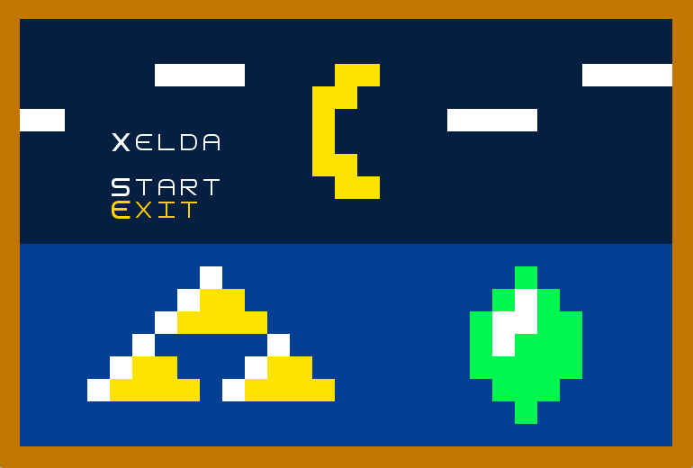
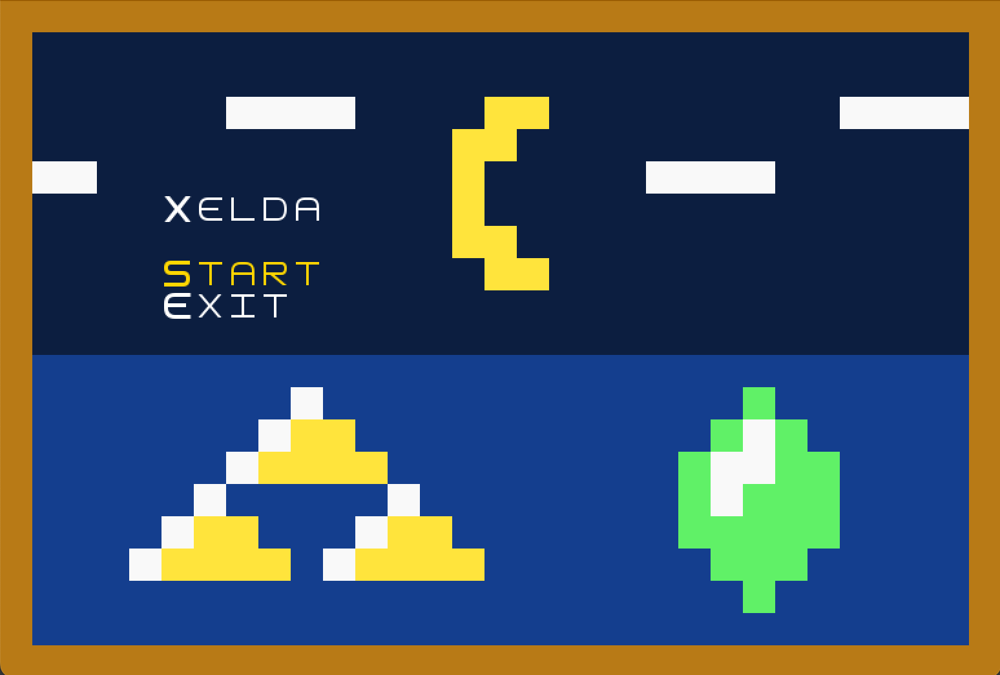
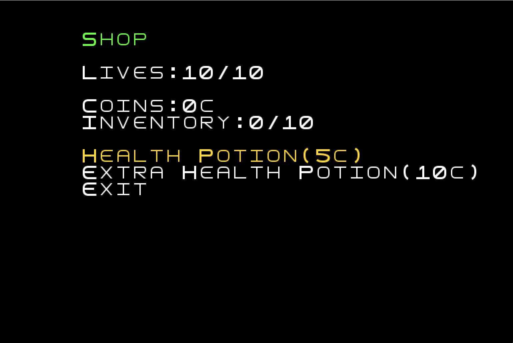
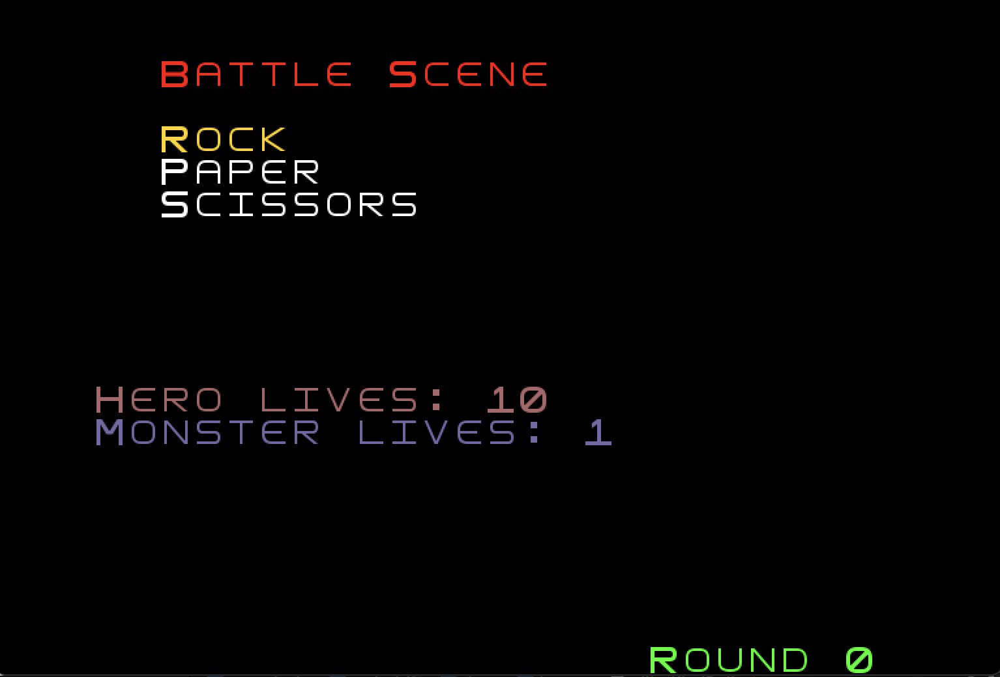
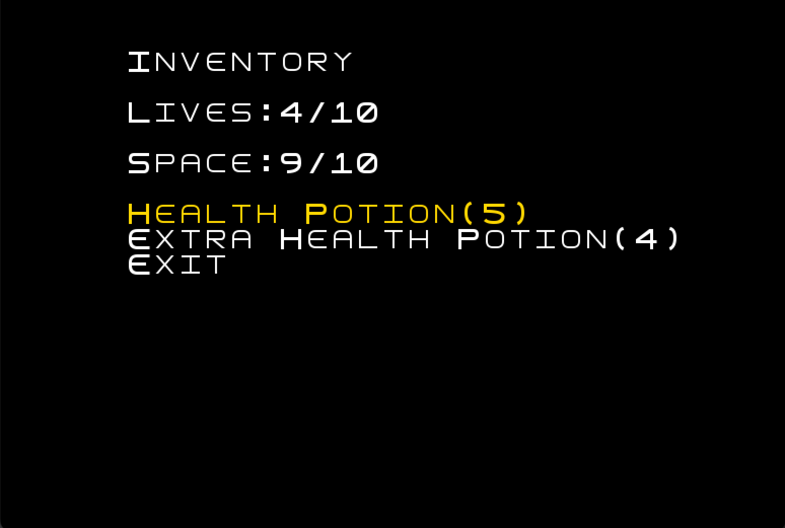
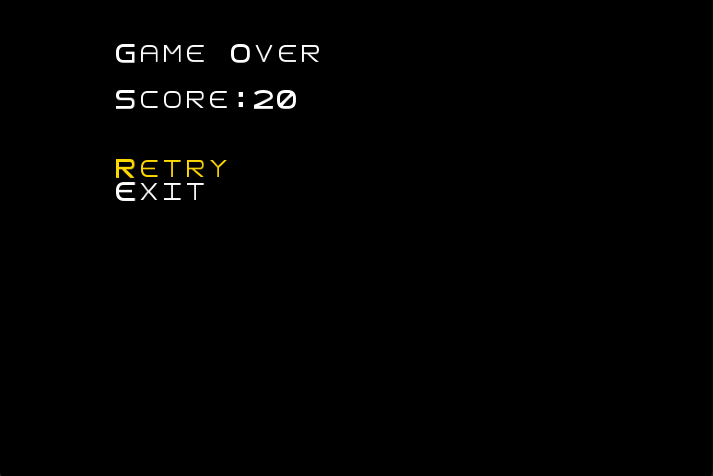
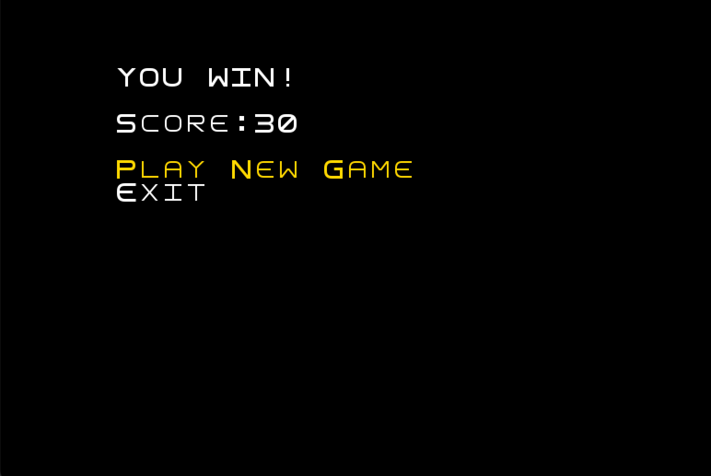

# LDTS_1604 - Xelda

## Game Description

**Xelda** is a RPG-style game inspired by the old versions of The Legend of Zelda, where you take control of our most 
loved hero : Link. Your goal is to reach the end of the maze, be careful with all the monsters and lookout for the keys
in order for you to advance in your journey. Remember, if by any chance you need some help you can always access the shop
and use the coins you've collected and in exchange you will receive items that will most certainly help you further along the road.

For a more detailed view of the project click [here](./docs/README.md).

---

## Game Preview

---
## Menus
 **Main Menu**

**Shop Menu**

**Battle Menu**

**Inventory Menu**

**Death Menu**

**Win Menu**

---
## Made by

- Bruno Pinheiro (up201705562)
- Eduardo Machado (up202105337)
- Henrique Silva (up202105647)