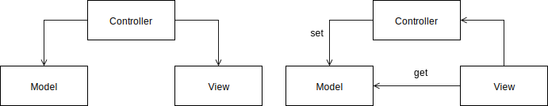
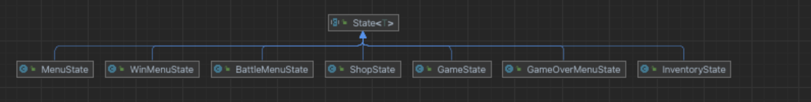
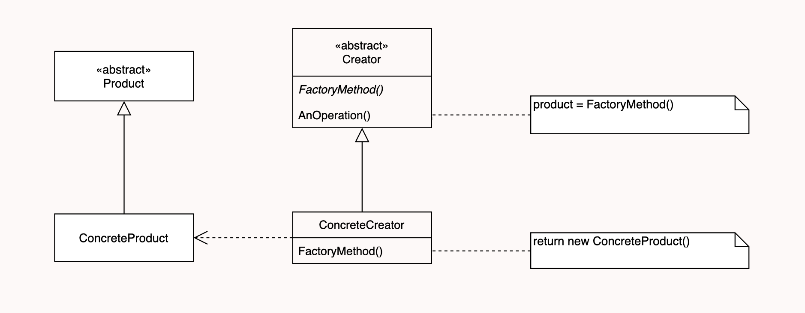
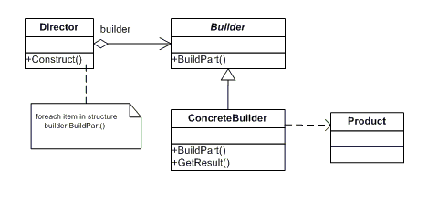
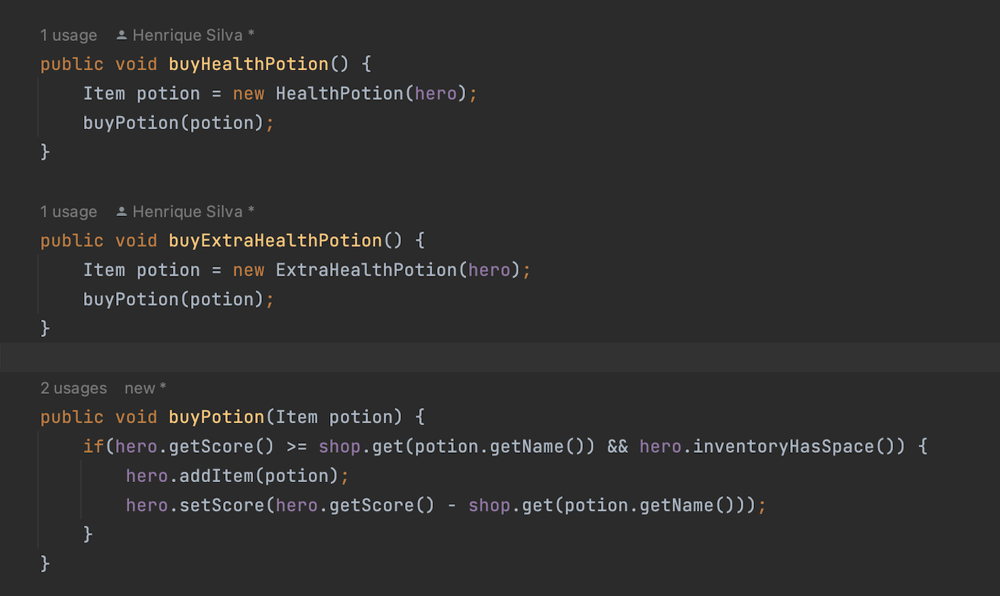
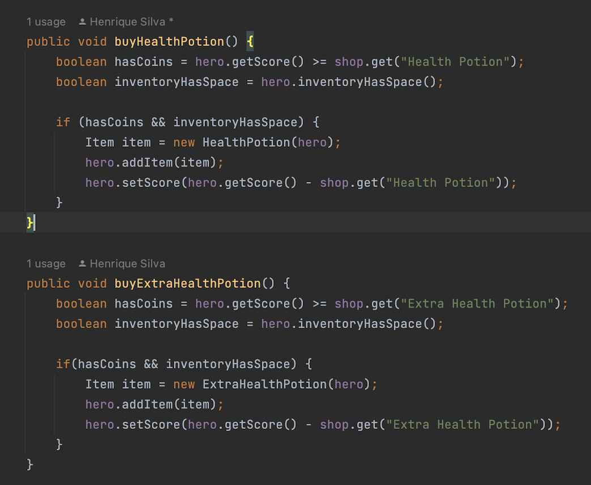
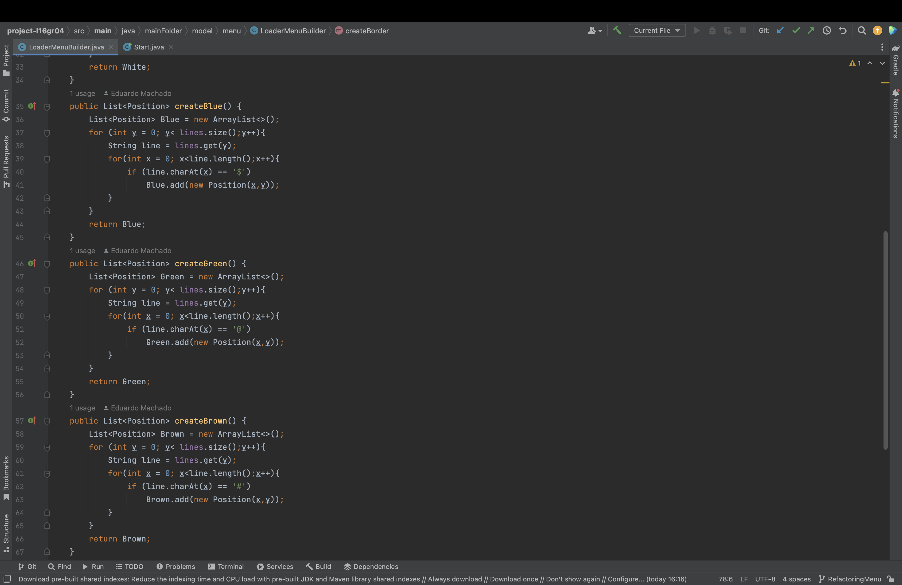
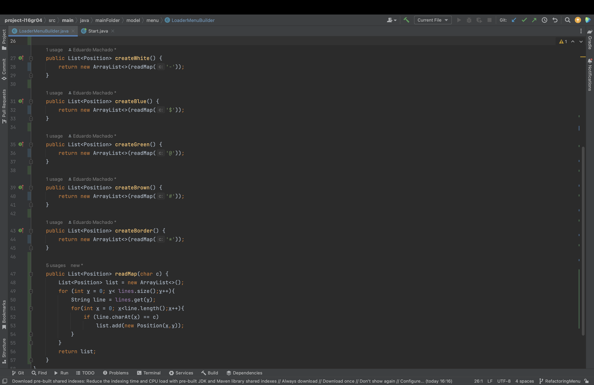
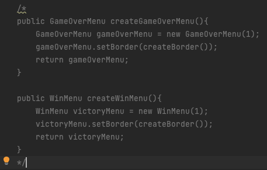
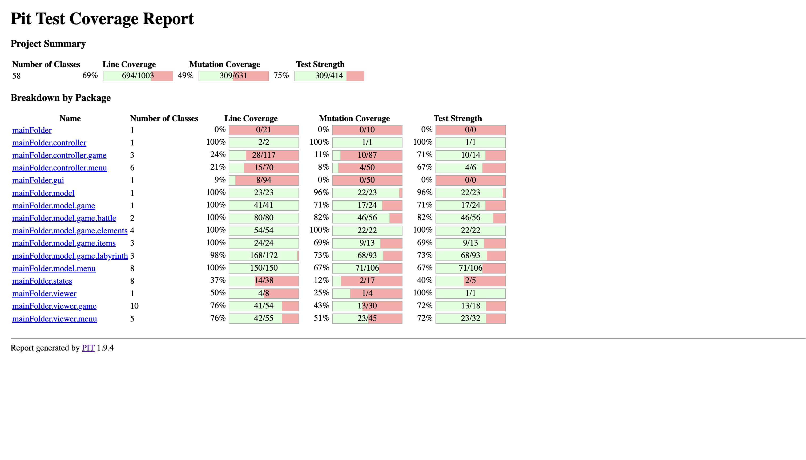

## LDTS-L16G04  <XELDA>

**Xelda Reminder:** This game is inspired by the old style Zelda games with our own twist.
The main character gets lost in a labyrinth and wants to find a way out but in his path he finds some troublesome monsters trying to capture him. 
The main character only has two options, run away or fight.

This project was developed by :
- Bruno Pinheiro (up201705562@fe.up.pt)
- Eduardo Machado (up202105337@fe.up.pt) 
- Henrique Silva (up202105647@fe.up.pt) 

for LDTS 2022/2023.

---
## Controls
- **Arrow-up** : Moves the character up.
- **Arrow-down** : Moves the character down.
- **Arrow-left** : Moves the character left.
- **Arrow-right** : Moves the character right.
- **P** : Opens shop.
- **I** : Opens Inventory.
- **Q** : Exits game.

---

## IMPLEMENTED FEATURES
- [x] Menu - When the game is initialized a Menu is displayed (the player chooses between playing or quitting)
- [x] Movement - The Hero moves in all directions when the corresponding keys are pressed.
- [x] Monsters - The monsters are placed all around the map and move across randomly.
- [x] Walls - The walls are repesented in the map by the following character '#' and do not allow the hero to get off the maze.
- [x] Coins - The coins are placed around the map just like the monsters and once they're picked up by the hero,
  its score is inceremented by 10 points.
- [x] Keys - One key is placed by level, it allows the Hero to open a door, access the portal and advance on his journey.
- [x] Doors - The Hero unlocks the door as soon as he collects the key corresponding to the level he is in.
- [x] Shop - The shop is represented in the map by the letter 'S' and is accessible if you press.
- [x] Potions - There are two types of potions available in the game, the first one is Health Potion that increments the character's lives by one,
  and the second one is the extra health potion with increases the number of total lives by equally by one.
- [x] Combat - Once the Hero encounters a monster he enters in Battle State, where the fighting mechanic consists
  in a game of Rock,Paper,Scissors. If the hero loses his lives are decremented by one, and he gets a new change to
  defeat the monster, in case of a tie nothing happens and if the hero wins the battle the monster is killed and disappears from the map.
- [x] Inventory - The inventory can be accessed by pressing the 'i' key and displays a menu where the hero can see all the items
  he disposes of up to a maximum capacity of 10 items.
- [x] Portals - Portals allow the hero to teleport himself into the next level and are displayed in the map with the letter 'P'.

---

## Planned Features

All the planned features were successfully implemented.

## Design

### General Structure
#### Problem in Context:

The architecture of the project is one of the most important parts of the project. Choosing the right approach is essential.
While we were organizing the project, we realized that the code would get very messy and hard to read without an appropriate structure.

#### The Pattern:

We have applied the **MVC** (model-view-controller) pattern. This pattern separates the game logic from the display code, allowing us to easily fix bugs and improve code readability.
We used the architectural pattern because its purpose is to store data (model), classes that control the logic of the game (controllers) and classes that are responsible for the visual effects on the screen (viewers).

#### Implementation:
With this pattern, we now haave classes which main purpose is to store data (model), classes for visual effects (viewers) and classes that control what happens in the game (controllers).
The following image shows how we implemented the pattern.

#### Consequences:
- Model - Represents the data.
- View - Displays the model data, and sends user actions (user inputs, such as pressing the keyboard) to the controller.
- Controller - Provides model data to the view, and processes user actions (user inputs, such as pressing the keyboard).

### States
#### Problem in Context:
In this game we can play, we can go into a shop, or into an inventory, or even battle. So we need to find a way to manage this whole aspect of the game.

### The Pattern:
The **State Pattern** is a great design pattern that allow us to manage this problem, providing a way to control everything in the game.

#### Implementation:
Every object has a state, that allows to manage what it does in the game.

#### Consequences:
- It makes state transitions explicit.
- Easy planning and maintenance.
- States can be shared.

### Labyrinth builder
#### Problem in Context:
In a labyrinth, we have a lot of elements, such as walls, keys, monsters, coins, a hero, a portal and a shop.
Since we have more than one level, we need to have a builder that needs to be able to build every labyrinth.

#### The Pattern:
The **Factory Method** and **Builder** are two design patterns optimal for this problem. While the first one provides an interface for creating objects and alter the type of objects that will be created, the second one allows to construct more complex objects in a way that makes the code simpler.

#### Implementation:
The LabyrinthBuilder is responsible for constructing the labyrinth, but the classes that extend this class are the ones that create the Labyrinth.
The builder pattern is implemented in all of the classes that use the labyrinthbuilder, allowing to construct the labyrinth in smaller steps.

#### Consequences:
- Great for maintaining the Open/Closed Principle. We can just add new features just by writing code.
- Provides 'hooks' for subclasses. Creating objects inside a class with a factory method is always more flexible than creating an object directly.
- Great control over the construction process.

------

## Refactoring and Code Smells
### **Extract Variable**
In order to simplify the if clause in Buypotion() method, we simply extracted the variables (Composing Method : Extract Variable). The conditions were very difficult to read, which made the method hard to understand. To resolve this problem we used Extract Variable, which made the code easier to read.

### **Extract Method**
Some methods were almost identical, so we used the Extract Method to simplify these methods. We did this by creating a new method which used the common parts of the other methods and we just called this method, which made the code easier to read, and eliminating long methods.

### **Dead code**
While we refactored the code, we stopped using some methods, becoming dead code, so we just deleted them.
The game worked exactly the same way as these methods weren't being used, therefore we can say that this was a chunk of dead code.

### **Feature envy and message chains**
As the result of the **MVC** (Model-View-Controller) pattern some controllers use is narrowed to its model method calls. Our controller envies its model.
Also, in order to access a certain model's parameter it is mandatory to start by making a request to its controller.

---
## TESTING

### Screenshot of coverage report

### Screenshot of pitest report

#### Link Mutation Testing Report
[Mutation tests](../build/reports/pitest/202212241037/index.html)

### SELF-EVALUATION
- Bruno Pinheiro (up201705562): 34%
- Eduardo Machado (up202105337): 33%
- Henrique Silva (up202105647): 33%